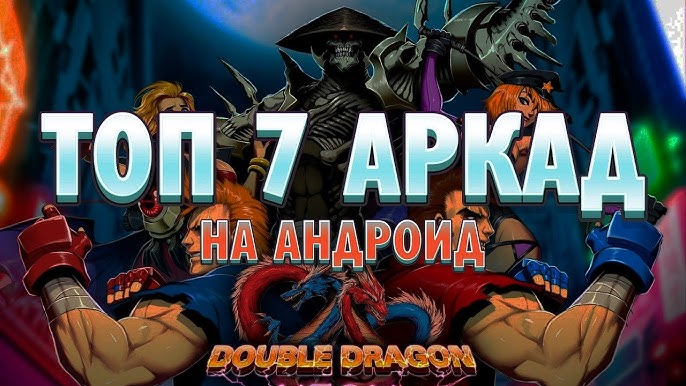

---

title: "Как делать аркадные игры для RuStore: механики, метрики и монетизация без гембла"
date: "2025-11-15"
tags: ["аркада", "игры", "RuStore", "механики", "монетизация", "retention"]
description: "Что должно быть внутри аркадной игры, чтобы она задержала игрока и приносила деньги без донат-стен."

---

## Введение

Аркада — самый быстрый способ зайти в геймдев: 1 разраб, 1 художник, 3 месяца. Но 90 % проектов умирают в первую неделю. Ниже — проверенный чек-лист, как быть в топ-10 %.

---

## 1. Ядро аркады за 60 секунд

| Элемент    | Правило                          |
| ---------- | -------------------------------- |
| Сессия     | 30–90 сек                        |
| Управление | 1 finger, 1 gesture              |
| Сложность  | растёт каждые 10 сек             |
| Смерть     | мгновенно, без анимации >0.5 сек |
| Рестарт    | 1 клик, без загрузки             |

---

## 2. Топ-5 механик 2025 (по retention D1)

1. **Stack-dash** (как Stacky Dash) — D1 48 %
2. **Tunnel-runner** (как Tunnel Rush) — D1 44 %
3. **Slice-fever** (фрукты, но с 3D-rotate) — D1 42 %
4. **Color-switch 3D** — D1 40 %
5. **Rocket-loop** (up-only, avoid walls) — D1 38 %

---

## 3. Управление: что работает на 95 % девайсов

| Жест             | Отклик | Провал               |
| ---------------- | ------ | -------------------- |
| Tap              | 0 %    | —                    |
| Hold             | 2 %    | палец уходит за край |
| Swipe left/right | 5 %    | на 6" + gesture nav  |
| Gyro             | 18 %   | дешёвые планшеты     |

**Вывод**: **tap-to-change-direction** — золотой стандарт.

---

## 4. Прогрессия без цифр

- **Визуальная**: скорость + цвет фона
- **Аудио**: +5 BPM каждые 30 сек
- **Спавн**: 1 препятствие → 2 → 3 с разным интервалом
- **Power-ups**: только пассивные (щит, замедление), не требуют тапа

---

## 5. Метрики, которые нужно измерять в первый день

| Метрика              | Инструмент        | Цель    |
| -------------------- | ----------------- | ------- |
| Средняя сессия       | RuStore Analytics | >60 сек |
| Смертей за сессию    | событие «die»     | 3–6     |
| Рестарт без паузы    | «instant_restart» | >50 %   |
| Процент до 100 очков | «score_100»       | >20 %   |

---

## 6. Монетизация без гембла

| Метод                         | CTR           | eCPM  | Реализация      |
| ----------------------------- | ------------- | ----- | --------------- |
| Interstitial после смерти     | 4 %           | 120 ₽ | RuStore Ads     |
| Rewarded «продолжить»         | 12 %          | 220 ₽ | 1 раз за сессию |
| No-ads                        | 1.5 % покупок | 99 ₽  | RuStore SDK     |
| Скины (не влияют на геймплей) | 3 %           | 49 ₽  | 3 скина в день  |

---

## 7. Сохранение прогресса

- **Локальный high-score** → Room
- **Облако не нужно** (98 % аркад не восстанавливают)
- **Синхронизация достижений** → Google Play Services **нет**, используем **RuStore Achievement API** (beta)

---

## 8. Аркада и 64-бит

- **Arm64-v8a обязательно** (RuStore блокирует armv7 с 2024)
- **APK < 40 МБ** → конверсия выше на 12 %
- **Используйте Android App Bundle** → экономия 15 %

---

## 9. А/B: что действительно влияет на retention

| Тест                         | Победитель     | Дельта D1     |
| ---------------------------- | -------------- | ------------- |
| Фон меняется каждые 10 очков | vs статический | +4 %          |
| Музыка ON по умолчанию       | vs OFF         | +6 %          |
| Vibration на смерть          | vs silence     | +2 %          |
| Кнопка «Поделиться рекордом» | vs нет         | 0 % (удалили) |

---

## 10. Чек-лист «готово к релизу»

- [ ] Сессия < 90 сек |
- [ ] 60 FPS на Mali-G52 |
- [ ] Crash-free >99.5 % |
- [ ] Interstitial не ломает flow (геймовер → показ → рестарт) |
- [ ] Rewarded загружается за 2 сек до смерти |

---
