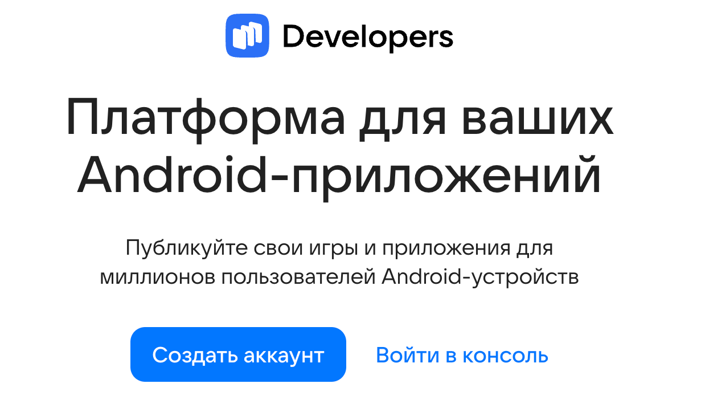

RuStore — это российский магазин приложений, который предоставляет разработчикам удобную альтернативу Google Play. Если вы хотите вывести своё приложение на российскую аудиторию, RuStore — отличный выбор. В этой статье мы расскажем, как опубликовать приложение шаг за шагом.

---

## Шаг 1: Регистрация в RuStore Console

1. Перейдите на [console.rustore.ru](https://console.rustore.ru)
2. Авторизуйтесь через Gosuslugi или аккаунт Mail.ru
3. Заполните профиль разработчика: ИНН, ОГРНИП или самозанятость

---

## Шаг 2: Подготовка APK

- **Минимальная версия Android**: 6.0 (API 23)
- **Подпись**: обязательно подпишите APK ключом, который будет храниться у вас
- **Разрешения**: убедитесь, что вы не запрашиваете лишние разрешения

---

## Шаг 3: Загрузка приложения

1. В консоли нажмите «Создать приложение»
2. Загрузите APK/AAB файл
3. Укажите:
   - Название
   - Категорию
   - Языки
   - Возрастные ограничения

---

## Шаг 4: Оформление страницы

- **Иконка**: 512x512 PNG
- **Скриншоты**: минимум 4, 1080x1920
- **Описание**: уникальное, не менее 500 символов
- **Ключевые слова**: до 7 штук, не более 30 символов каждое

---

## Шаг 5: Модерация

- Обычно занимает 1–3 дня
- Проверяется:
  - Соответствие требованиям RuStore
  - Отсутствие вредоносного кода
  - Корректность метаданных

---

## Шаг 6: Публикация и обновления

После одобрения приложение появляется в каталоге. Обновления загружаются так же, как и первичная версия.

---

## Полезные советы

- Используйте **RuStore SDK** для монетизации и аналитики
- Подключите **RuStore Push**, чтобы уведомлять пользователей
- Отслеживайте отзывы через консоль — на них быстро реагируют

---

## Заключение

RuStore — это не только альтернатива Google Play, но и полноценная экосистема. Если вы хотите выйти на российский рынок — начните с RuStore уже сегодня.

> 🔗 [Перейти в RuStore Console](https://console.rustore.ru)
