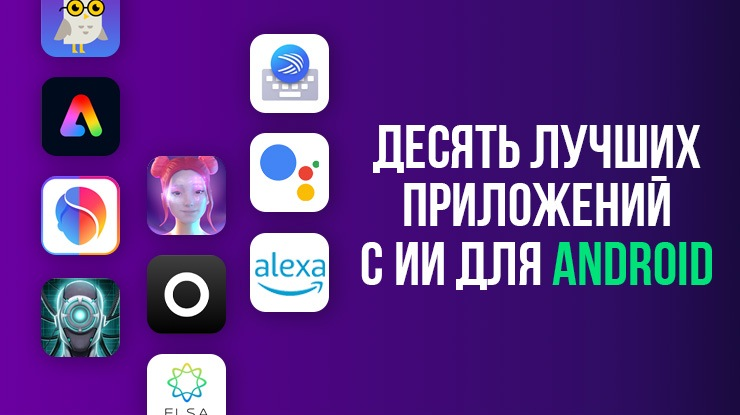
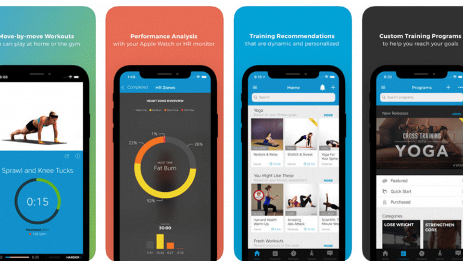
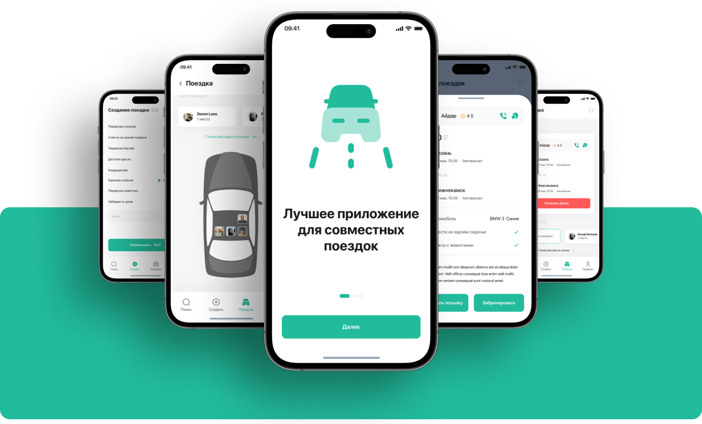

## Методология

Анализ по данным RuStore Console за Q3 2025: скачивания, retention, оценки, отзывы.

---

## 1. Генераторы ИИ-контента

- **Спрос**: +340 % за год
- **Форматы**: текст, картинки, голос
- **Примеры**: «ИИ-резюме», «Генератор постов для VK»
- **Must-have**: офлайн-режим, шаблоны на русском

---

## 2. Микро-фитнес (7-минутные тренировки)

- **ЦА**: 25–35, самозанятые
- **Фичи**: таймер, напоминания, голосовой коуч
- **Retention D7**: 38 % (выше среднего по Health)

---

## 3. Приложения для Госуслуг

- **Спрос**: рост после 2024
- **Фичи**: push о новых штрафах, оплата налогов, сканер паспорта
- **Особенность**: нужен ЕСИА-логин

---

## 4. QR-сканеры без рекламы

- **Боль**: стоковые сканеры заваливают баннерами
- **Фичи**: сканер из шторки, история сканов, экспорт в PDF
- **Монетизация**: платная версия без рекламы (99 ₽)

---

## 5. Молитвенники и духовные практики

- **Гео**: Татарстан, Башкортостан, Чечня
- **Фичи**: таймер, qibla-компас, аудио на арабском
- **Локализация**: татарский, чеченский

---

## 6. Самозанятые → фин-трекеры

- **ЦА**: курьеры, beauty-мастера
- **Фичи**: скан чеков, автоматический налог, экспорт в ФНС
- **Интеграция**: СберКоннект, Тинькофь API

---

## 7. Визуальные дневники

- **Формат**: фото + стикеры + текст
- **Фичи**: шаблоны «день как он есть», off-line галерея
- **Retention**: D30 = 22 % (приложение-соцсеть 12 %)

---

## 8. Приложения-«тихие» будильники

- **Боль**: стандартные будильники режут слух
- **Фичи**: постепенное увеличение громкости, вибрация-пиксель
- **ЦА**: студенты в общежитиях, молодые родители

---

## 9. Онлайн-очереди в поликлиники

- **Гео**: регионы с дефицитом талонов
- **Фичи**: парсинг талонов, push-уведомление «появился талон»
- **Партнёрство**: интеграция с ГосУслугами Health

---

## 10. Приложения для поиска попутчиков в междугороднем транспорте

- **Боль**: BlaBlaCar не всегда работает в регионах
- **Фичи**: без регистрации, оплата наличкой, чат-анонимайзер
- **Безопасность**: верификация через паспорт + selfie

---

## Чек-лист «проверить нишу»

1. Открыть RuStore → категория → «новые»
2. Посчитать приложения < 3 месяцев с >10 тыс установок
3. Прочитать негативные отзывы → список фичей
4. Оценить средний рейтинг < 4.3 → шанс сделать лучше

---

## Вывод

Самые горячие точки — это **региональные боли** и **микро-привычки**. Делайте узко — побеждаете быстро.
